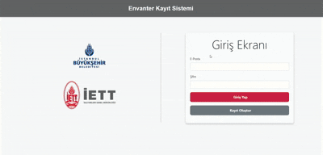

# 📦 İETT Envanter Kayıt Sistemi

Bu proje, **İETT Bilgi İşlem** departmanındaki stajım sırasında geliştirilmiş bir **envanter kayıt sistemi web uygulamasıdır**.

Uygulamanın temel amacı, kurum envanterindeki ürünlerin (marka, model, kategori) ve bu ürünlere bağlı işlemlerin (personel sicili, adet, tarih) dijital olarak yönetilmesini sağlamaktır.  
Sistem, rol bazlı erişim kontrolü sunarak **"Admin"** ve **"Kullanıcı"** rolleri için farklı yetkilendirmeler sağlar.

---

## 🎥 Proje GIF'i

<p align="center">
  
  <br>
  <em>Uygulamanın temel işlevlerini gösteren kısa bir demo</em>
</p>

---

## 🚀 Temel Özellikler

- **🔐 Güvenli Kullanıcı Yönetimi:**  
  MD5 ile şifrelenmiş parola korumalı **Kayıt Ol** (`/Register`), **Giriş Yap** (`/Login`) ve **Çıkış Yap** (`/Logout`) özellikleri.

- **👮 Rol Bazlı Erişim Kontrolü:**  
  "Admin" rolüne sahip kullanıcılar (`User.IsInRole("admin")`) envanter oluşturma, düzenleme ve silme gibi kritik işlemleri yapabilirken, normal kullanıcılar bu alanlara erişemez.

- **🚚 İşlem (Envanter) Yönetimi:**  
  Personele (sicil numarası ile) ürün (marka, model) atama, adet ve tarih belirleme.

- **🏷️ Ürün Yönetimi:**  
  Sisteme yeni ürünler (Marka, Model) ekleme ve bu ürünleri **Ürün Kategorileri** ile ilişkilendirme.

- **📁 Kategori Yönetimi:**  
  Ürünleri sınıflandırmak için dinamik kategoriler oluşturma ve listeleme.

- **🔄 Dinamik Formlar:**  
  JavaScript kullanılarak "İşlemler" sayfasında bir marka seçildiğinde ilgili modellerin otomatik olarak "Model" dropdown menüsüne yüklenmesi.

- **↕️ Aktif / Pasif Durum Yönetimi:**  
  Tüm kayıtların (İşlemler, Kategoriler, Ürünler) durumunu "Aktifleştir" veya "Pasifleştir" butonlarıyla yönetebilme.

- **📄 Sayfalama (Pagination):**  
  Tüm tablolarda (İşlemler, Kategoriler, Ürünler) kayıtları bölerek hızlı ve verimli bir kullanıcı deneyimi sağlama.

- **🔔 Anlık Bildirim Sistemi:**  
  `TempData` kullanılarak başarılı (yeşil) veya hatalı (kırmızı) işlemlerde kullanıcıya 3 saniyeliğine görünen pop-up uyarı mesajları gösterme.

---

## 🛠️ Kullanılan Teknolojiler

Aşağıda projede kullanılan tüm teknolojiler ve görevleri yer almaktadır:

| 💡 Kategori | 🧩 Teknoloji / Araç | 📝 Açıklama |
|-------------|--------------------|-------------|
| **Backend** | `C#` | Uygulama programlama dili |
|  | `ASP.NET Core MVC` | Web uygulaması altyapısı |
| **Veritabanı** | `Entity Framework Core` | ORM – veritabanı işlemleri için |
|  | `Microsoft SQL Server` | Veritabanı yönetim sistemi |
|  | `EF Core Migrations` | Veritabanı şema yönetimi |
| **Frontend** | `HTML5` | Sayfa yapısı ve etiketleme |
|  | `CSS3` | Tasarım, özel sidebar ve form stilleri |
|  | `JavaScript (ES6+)` | Dinamik formlar, bildirim sistemi |
|  | `Bootstrap` | Responsive grid sistemi ve stil bileşenleri |
| **Kimlik Doğrulama** | `ASP.NET Core Cookie Authentication` | Oturum ve kullanıcı yönetimi |
|  | `MD5 + Salt` | Parola güvenliği için hashing yöntemi |

---

## 🏁 Projeyi Çalıştırma

Projeyi yerel makinenizde çalıştırmak için aşağıdaki adımları izleyin:

1. 📥 Bu depoyu klonlayın:
    ```bash
    git clone https://github.com/kullanici-adiniz/proje-adiniz.git
    ```

2. 🧩 `iettproje` klasöründeki `appsettings.Development.json` dosyasını oluşturun.  
   (Bu dosya `.gitignore` ile gizlenmiştir.)

3. 🔌 Dosyaya veritabanı bağlantınızı ekleyin:
    ```json
    {
      "ConnectionStrings": {
        "baglanti": "Server=SUNUCU_ADINIZ;Database=IETT_EnvanterDB;Trusted_Connection=True;TrustServerCertificate=True;"
      }
    }
    ```

4. 💿 Visual Studio'da `Package Manager Console`'u açın ve `Migrations`'ı uygulayarak veritabanını oluşturun:
    ```powershell
    Update-Database
    ```

5. ▶️ Projeyi Visual Studio'da **F5** tuşuna basarak veya **Başlat (Start)** düğmesiyle çalıştırın.

---

## 👨‍💻 Geliştirici

**Berat Baş**  
📧 [GitHub Profilim](https://github.com/beratbas)

---

## 🪪 Lisans

Bu proje, **eğitim ve portföy amacıyla** oluşturulmuş açık kaynak bir projedir.  
Kaynak gösterilerek kullanılabilir, geliştirilebilir veya genişletilebilir. ❤️
